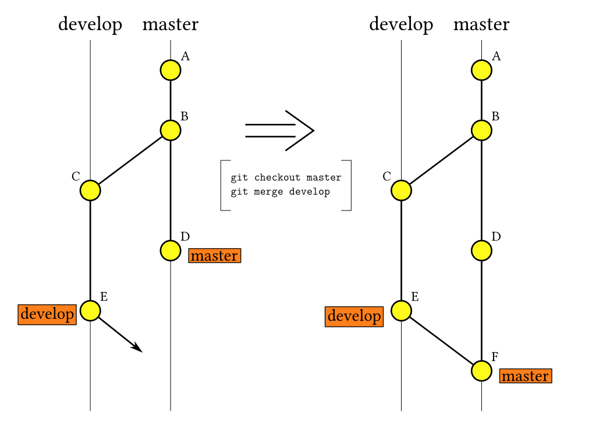

# Git Basics

Table of Contents:

1. Git Overview
2. Basic Steps of Git
3. Basic Git Example
4. Basic Commands
5. Graphical Representation

## Git Overview

Git is a Version Control System (VCS) designed to keep track of changes to files across multiple authors and machines.
GitHub is a free public service the hosts the server-side copy (the "remote").
GitLab is a similar service, which in our case is hosted from our own server. Each user can create copy ("clone") the remote on their machine to have a local copy that they can edit however they like. Each repo has a main working tree (usually called the "master" branch) and can have an infinite number of other branches that can be edited back into master.
Git will automatically check that a merge will not cause conflicts, such as multiple different edits to the same file, and offers tools to resolve such conflicts.

## Basic Steps of Git

1. A branch is created. When created, a branch is identical to the point it stems from.
2. Files are created, changed, or deleted.
3. New changes are listed as "unstaged." This means that changes are noticed, but not included for the next commit. Changes must be manually staged to be included in the next commit.
4. Staged changes are stored as a commit. A commit stores the changed lines of each file that was staged. Each commit has an associated hash, generated from a SHA1 checksum of the contents of the commit. Each hash is unique, and can be used to refer to the commit (usually only the first 7 characters of the hash are used). Each commit also has at least one line of text included as the Commit Message, which is a brief summary of changes made in that commit.
5. Commits are uploaded to the remote from your local. This process is called pushing the commit. Pushing will upload any commits the remote doesnt have to the remote. Always pull before pushing, as someone else could have edited the same files, causing merge conflicts.
6. Someone else can then download new commits to their own local. This is called pulling.
7. Once you've committed all changes you need, you can merge your branch back into master via a Merge Request.

## Basic Git Example

What follows is a basic example of creating a new branch from master, creating a new file, committing the changes, and pushing the commit.

```
git branch mybranch master			# Create a new branch named "mybranch" from master
git checkout mybranch				# Switch to the branch "mybranch"
vim README.md			                # Create and edit README.md (vim is a text editor)
git pull				        # Pull commits from master
git add README.md				# Stage README.md for commit
git commit -m 'Add README.md'		        # Create a commit with a message
git push				        # Push the commit to the remote
```

There are commands to merge branches, it is easier and preferred to do it via a Merge Request

## Graphical Representation



Events in the image above:

1. Commit A is created and pushed to master
2. Commit B is created and pushed to master
3. The branch "develop" is created from master after Commit B
4. Commit C is created and pushed to develop
5. Commit D is created and pushed to master
6. Commit E is created and pushed to develop
7. Develop is merged into master as Commit F
